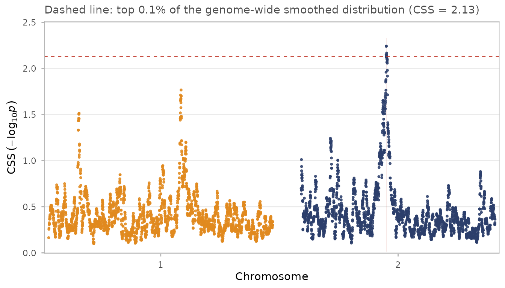
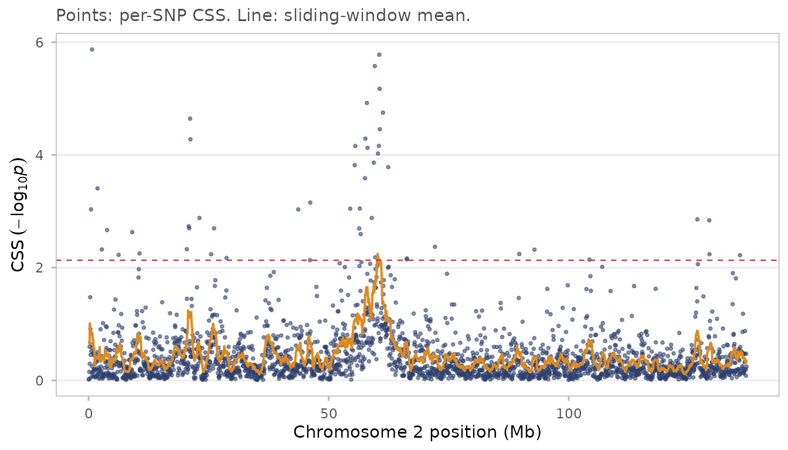
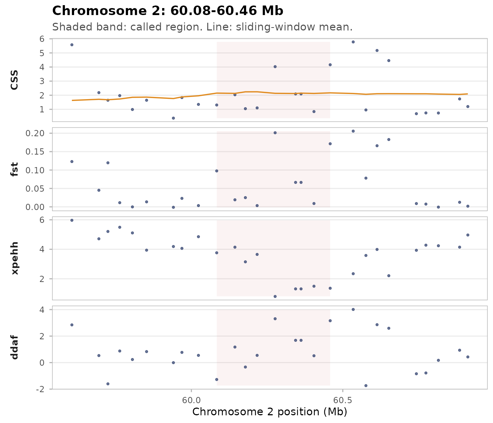
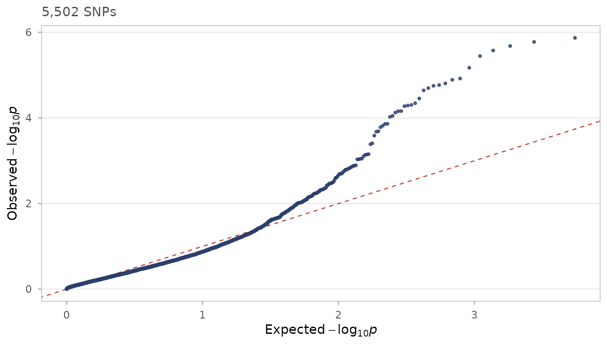
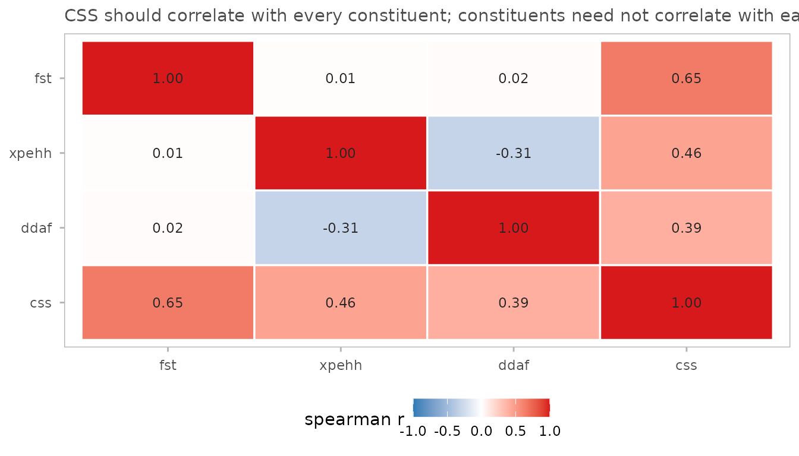

# Getting started with composite selection signals

``` r

library(cssig)
library(data.table)
```

## What CSS does

Composite selection signals (CSS) combine several selection tests into
one index. Each constituent test is ranked genome-wide, the ranks become
normal quantiles, and the quantiles are averaged across tests at every
SNP. A locus where several tests agree rises; a locus where only one
test is extreme is pulled back towards the genome-wide average.

The method is due to Randhawa, Khatkar, Thomson and Raadsma
([2014](https://doi.org/10.1186/1471-2156-15-34),
[2015](https://doi.org/10.1534/g3.115.017772)).

## The input

`cssig` starts from **pre-computed constituent statistics**, one row per
SNP. It does not read VCFs or compute XP-EHH; use `rehh`, `selscan` or
`hapbin` for that and bring the results here.

``` r

data(css_sim_small)
head(css_sim_small[, .(chr, pos, fst, xpehh, ddaf)])
#>       chr    pos          fst     xpehh      ddaf
#>    <fctr>  <num>        <num>     <num>     <num>
#> 1:      1  31502  0.033731900 -0.400611 -1.601780
#> 2:      1 185282 -0.000442191 -0.789998 -0.258591
#> 3:      1 265069  0.024843400 -0.905406 -1.168970
#> 4:      1 391046  0.009940270 -0.602531  0.830885
#> 5:      1 442469  0.005942830  0.781350 -0.631699
#> 6:      1 577946  0.015554700  0.400111  1.054750
```

These are simulated data with sweeps in known places — see
[`?css_sim`](https://msk99.github.io/cssig/reference/css_sim.md) for how
they were generated, and `css_sim_truth` for the answers.

[`css_input()`](https://msk99.github.io/cssig/reference/css_input.md)
validates the table and records, per test, which direction means “more
evidence of selection”:

``` r

x <- css_input(css_sim_small,
               tests = c(fst = "high", xpehh = "high", ddaf = "high"))
x
```

## The pipeline

``` r

res <- css(x)
res <- css_smooth(res, half_width = 5e5, min_snps = 5)
res <- css_threshold(res, top = 0.001)
#> Threshold on smoothed CSS: top 0.1% at 2.1320 (6 SNPs), top 1.0% at 1.5565 (56 SNPs).
```

Each stage adds columns to `res`. Because `data.table` assigns by
reference, no copy of the table is made between stages — but the object
you passed to
[`css_input()`](https://msk99.github.io/cssig/reference/css_input.md) is
never touched:

``` r

"css" %in% names(css_sim_small)   # the original is unchanged
#> [1] FALSE
```

If you would rather each stage returned a fresh copy, pass
`.copy = TRUE`.

## Calling regions

Two rules are available, one from each paper. `"cluster"` (the 2014
rule) wants at least three significant SNPs within a window; `"flank"`
(the 2015 rule) wants one top-0.1% SNP flanked by five top-1%
neighbours.

``` r

reg <- css_regions(res, method = "cluster")
summary(reg)
#> Key: <chr>
#>    region chr    position span_kb peak_Mb peak_css n_snps n_sig n_fst n_xpehh
#> 1:      1   2 60.08-60.46     375  60.217     2.24      6     6     0       0
#>    n_ddaf
#> 1:      0
#> 
#> Positions in Mb. n_* columns count SNPs in each test's own top fraction.
```

The `n_*` columns count how many SNPs in each constituent test’s *own*
top fraction fall inside the region. This is the comparison in Table 2
of the 2014 paper, and it is how you tell whether a composite signal is
supported by several tests or driven by one.

## Plots

``` r

css_manhattan(res, regions = reg)
```



``` r

css_chrom_plot(res, chr = "2")
```



Points are per-SNP CSS; the line is the sliding-window mean.

``` r

if (nrow(reg)) css_region_plot(res, reg[1])
```



## Checking the null

Under no selection the CSS p-values should be uniform. A QQ plot that
leaves the diagonal along its whole length, rather than only at the
tail, means the null is miscalibrated — usually because the constituent
tests are strongly correlated.

``` r

css_qq(res)
```



``` r

css_test_cor(res)
```



CSS should correlate with each constituent. The constituents need not
correlate much with each other — that they do not is exactly why
combining them helps.

## Three things worth knowing

**CSS depends only on ranks.** Standardising XP-EHH or ΔDAF to *N*(0,1),
as both papers do, leaves CSS *exactly* unchanged. It matters only for
plotting. More generally, any strictly increasing transform of a
constituent test gives identical CSS:

``` r

d2 <- copy(css_sim_small)
d2[, fst := exp(fst * 5)]
r2 <- css(css_input(d2, tests = c(fst = "high", xpehh = "high", ddaf = "high")))
all.equal(res$css, r2$css)
#> [1] TRUE
```

**Ranks are genome-wide.** Adding or removing SNPs changes every SNP’s
CSS. Keep the SNP set fixed when comparing runs.

**Smoothed scores are not p-values.**
[`css_smooth()`](https://msk99.github.io/cssig/reference/css_smooth.md)
averages −log10(*p*) over neighbouring SNPs; the result is a useful
score but no longer a p-value, so
[`css_fdr()`](https://msk99.github.io/cssig/reference/css_fdr.md)
refuses smoothed input. Estimate FDR first, then smooth:

``` r

fdr_res <- css_fdr(css(css_input(css_sim_small,
                     tests = c(fst = "high", xpehh = "high", ddaf = "high"))),
                   method = "BH")
#> FDR (BH): 30 SNPs with q <= 0.05, 13 with q <= 0.01.
sum(fdr_res$qval <= 0.05)
#> [1] 30
```

**And the raw CSS p-value is not calibrated either.** The formula *p* =
1 − Φ(√*m* · Z̄) assumes the constituent tests are independent. They are
not, and the correlation is not always positive — in `css_sim`, XP-EHH
and ΔDAF correlate at about −0.32, which *deflates* the variance of Z̄:

``` r

r_full <- css(css_input(css_sim_small,
                        tests = c(fst = "high", xpehh = "high", ddaf = "high")))
sd(sqrt(3) * r_full$zbar)   # 1.0 only if the tests were independent
#> [1] 0.9085172
```

So treat CSS as a **ranking**, not as a calibrated tail probability.
This is why both papers threshold on the empirical top 0.1% rather than
on a p-value, and why
[`css_fdr()`](https://msk99.github.io/cssig/reference/css_fdr.md)’s
output deserves a look at
[`css_qq()`](https://msk99.github.io/cssig/reference/css_qq.md) before
you lean on it. See
[`?css_fdr`](https://msk99.github.io/cssig/reference/css_fdr.md) for the
details.

## Where to go next

- [`vignette("simulation")`](https://msk99.github.io/cssig/articles/simulation.md)
  — how the example data were built, a power comparison of CSS against
  each constituent test on data where the truth is known, and a worked
  demonstration of the `weights` argument.
- [`?css_reciprocal`](https://msk99.github.io/cssig/reference/css_reciprocal.md)
  — the signed, two-direction contrast of the 2015 paper.
- [`?css_circos`](https://msk99.github.io/cssig/reference/css_circos.md)
  — the circular multi-track plot.

## References

The method is defined in the first of these; the second extends it to
complex traits and adds the reciprocal cohort contrast.

Randhawa IAS, Khatkar MS, Thomson PC, Raadsma HW (2014). Composite
selection signals can localize the trait specific genomic regions in
multi-breed populations of cattle and sheep. *BMC Genetics* **15**:34.
<doi:%5B10.1186/1471-2156-15-34>\](<https://doi.org/10.1186/1471-2156-15-34>)

Randhawa IAS, Khatkar MS, Thomson PC, Raadsma HW (2015). Composite
selection signals for complex traits exemplified through bovine stature
using multibreed cohorts of European and African *Bos taurus*. *G3*
**5**:1391-1401.
<doi:%5B10.1534/g3.115.017772>\](<https://doi.org/10.1534/g3.115.017772>)

``` r

citation("cssig")
#> To cite cssig, please cite the two papers describing the CSS method:
#> 
#>   Randhawa I, Khatkar M, Thomson P, Raadsma H (2014). "Composite
#>   selection signals can localize the trait specific genomic regions in
#>   multi-breed populations of cattle and sheep." _BMC Genetics_, *15*,
#>   34. doi:10.1186/1471-2156-15-34
#>   <https://doi.org/10.1186/1471-2156-15-34>.
#> 
#>   Randhawa I, Khatkar M, Thomson P, Raadsma H (2015). "Composite
#>   selection signals for complex traits exemplified through bovine
#>   stature using multibreed cohorts of European and African Bos taurus."
#>   _G3 Genes|Genomes|Genetics_, *5*, 1391-1401.
#>   doi:10.1534/g3.115.017772 <https://doi.org/10.1534/g3.115.017772>.
#> 
#> To see these entries in BibTeX format, use 'print(<citation>,
#> bibtex=TRUE)', 'toBibtex(.)', or set
#> 'options(citation.bibtex.max=999)'.
```
