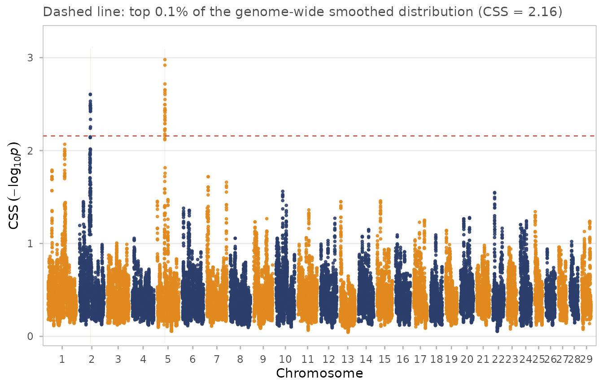
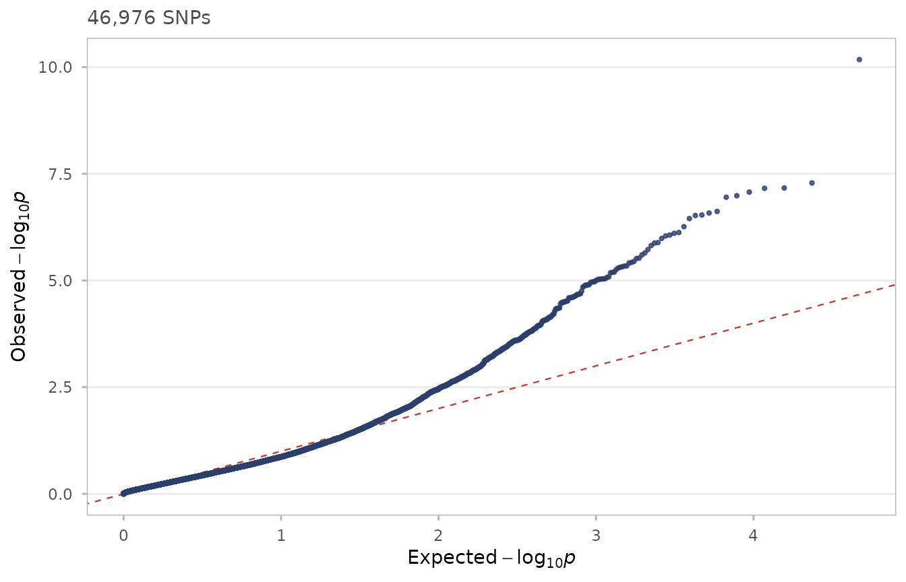
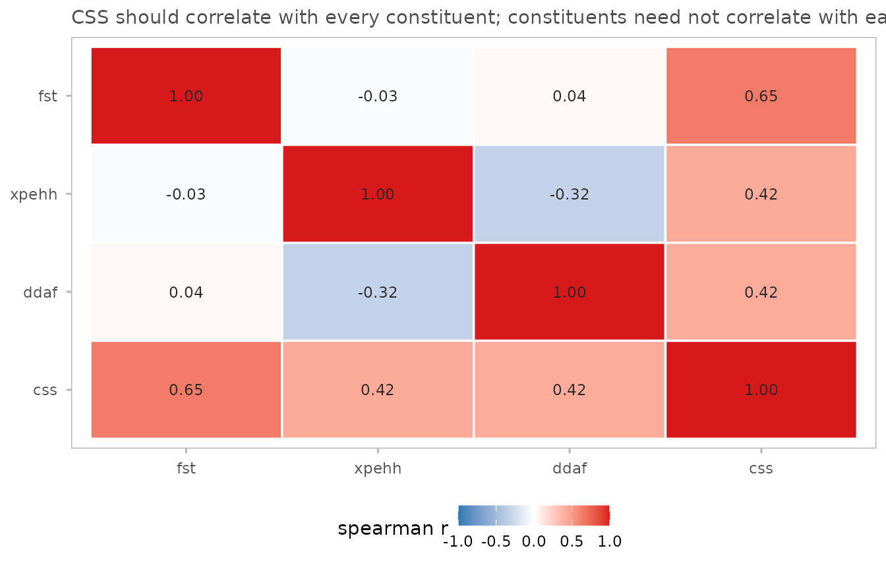
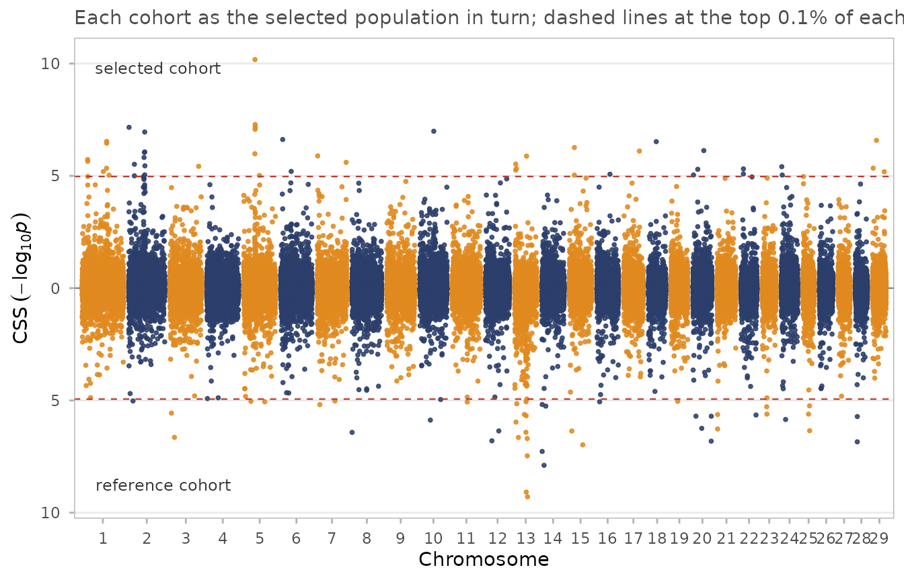

# The simulated dataset, and does CSS actually beat its constituents?

``` r

library(cssig)
library(data.table)
data(css_sim)
data(css_sim_truth)
```

## Why the data are simulated the way they are

The obvious way to build an example dataset is to draw *F*_(ST), XP-EHH
and ΔDAF from some distribution and add bumps where the sweeps should
be. That would be quick, and it would be useless for the question this
vignette asks.

The three constituent tests are correlated because they read the same
underlying genealogy — that is the entire premise of CSS. Simulating
them independently means choosing that correlation by hand, and then any
demonstration that CSS beats its constituents is measuring the choice,
not the method.

So `css_sim` is built the long way: simulate a population, then compute
the statistics from it. Sixteen breeds descend from a bottlenecked
ancestral population (coalescent, via `scrm`), then breed formation runs
forward as a Wright–Fisher process with recombination for 40 generations
at *N*_(e) = 150, during which the sweeps act. Eight breeds form the
selected cohort, eight the reference. SNPs are then ascertained
chip-style. See
[`?css_sim`](https://msk99.github.io/cssig/reference/css_sim.md) and
`data-raw/README.md` for the details.

## The known answers

``` r

css_sim_truth[, .(sweep_id, chr, pos, scenario, s, target_freq, cohort)]
#>    sweep_id    chr      pos                                      scenario     s
#>      <char> <char>    <num>                                        <char> <num>
#> 1:        1      2 60000000                           complete hard sweep  0.50
#> 2:        2      1 95000000                         incomplete hard sweep  0.30
#> 3:        3      6 40000000            soft sweep from standing variation  0.20
#> 4:        4     14 30000000              weak sweep on standing variation  0.10
#> 5:        5     10 55000000                   breed-restricted hard sweep  0.45
#> 6:        6     13 45000000                 sweep in the reference cohort  0.45
#> 7:     trap      5 42500000 founder-effect haplotype block (no selection)  0.00
#>    target_freq                   cohort
#>          <num>                   <char>
#> 1:        0.99                 selected
#> 2:        0.70                 selected
#> 3:        0.85                 selected
#> 4:        0.60                 selected
#> 5:        0.98 selected (4 of 8 breeds)
#> 6:        0.98                reference
#> 7:          NA    selected (breeds 1-4)
```

Six genuine sweeps spanning distinct scenarios, plus one trap. The trap
carries no selection at all: in four selected-cohort breeds the whole
region descends from a single founder haplotype, which is what happens
when a breed is founded from few animals. It produces real
differentiation and real long-range homozygosity, through drift.

It is included to show what the method does in that situation — **not**
because it is guaranteed to escape detection. See the last section.

## Running CSS

``` r

x <- css_input(css_sim, tests = c(fst = "high", xpehh = "high", ddaf = "high"))
res <- css_threshold(css_smooth(css(x)), top = 0.001)
#> Threshold on smoothed CSS: top 0.1% at 2.1575 (47 SNPs), top 1.0% at 1.1796 (470 SNPs).
reg <- css_regions(res, method = "cluster")
reg[, .(region_id, chr, start, end, n_sig, peak_pos, peak_css)]
#> <css_regions> 2 regions, method = "?"
#>   span: median 1.30 Mb, range 1.00-1.60 Mb; 47 significant SNPs total
#> 
#> Key: <chr>
#>    region_id chr    start      end n_sig peak_pos peak_css
#> 1:         1   2 60023273 61018705    21 60217074 2.606478
#> 2:         2   5 42064704 43664827    26 42910398 2.978812
```

``` r

css_manhattan(res, regions = reg)
```



## Which sweeps were recovered?

Two things need care before any number here means anything.

**Region boundaries do not land on the causal site.** The causal
variants are excluded from the panel, exactly as they would be from a
real SNP chip, so the nearest significant SNP usually sits just outside.
Both source papers add 0.5 Mb on each side when mining regions for
genes, which is what `start_padded` / `end_padded` are for. Recovery is
judged against those.

**“Maximum CSS within 0.5 Mb” is not a calibrated statistic.** The
maximum over ~18 SNPs sits near the 95th percentile of the *per-SNP*
distribution by chance alone, so scoring a sweep that way makes noise
look like signal. Compare bin maxima against bin maxima instead.

``` r

recovered <- function(regions, truth) {
  vapply(seq_len(nrow(truth)), function(i) {
    any(as.character(regions$chr) == truth$chr[i] &
        regions$start_padded <= truth$pos[i] &
        regions$end_padded   >= truth$pos[i])
  }, logical(1))
}

# percentile of each locus's 1 Mb bin, ranked against every 1 Mb bin genome-wide
bin_rank <- function(res, col = "css_smooth") {
  d <- as.data.table(res)[!is.na(get(col))]
  b <- d[, .(m = max(get(col))), by = .(chr, bin = floor(pos / 1e6))]
  b[, pct := 100 * frank(m) / .N][]
}

truth <- copy(css_sim_truth)
b <- bin_rank(res)
truth[, found := recovered(reg, truth)]
truth[, pct := vapply(seq_len(.N), function(i) {
  v <- b[as.character(chr) == truth$chr[i] & bin == floor(truth$pos[i] / 1e6), pct]
  if (!length(v)) NA_real_ else round(v, 2)
}, numeric(1))]
truth[, .(sweep_id, chr, s, scenario, found, pct)]
#>    sweep_id    chr     s                                      scenario  found
#>      <char> <char> <num>                                        <char> <lgcl>
#> 1:        1      2  0.50                           complete hard sweep   TRUE
#> 2:        2      1  0.30                         incomplete hard sweep  FALSE
#> 3:        3      6  0.20            soft sweep from standing variation  FALSE
#> 4:        4     14  0.10              weak sweep on standing variation  FALSE
#> 5:        5     10  0.45                   breed-restricted hard sweep  FALSE
#> 6:        6     13  0.45                 sweep in the reference cohort  FALSE
#> 7:     trap      5  0.00 founder-effect haplotype block (no selection)   TRUE
#>       pct
#>     <num>
#> 1:  99.92
#> 2:  98.06
#> 3:  96.95
#> 4:  36.39
#> 5:  91.73
#> 6:  77.61
#> 7: 100.00
```

`pct` is the percentile of the sweep’s megabase among all 2528 megabases
in the genome.

## CSS against each constituent test, on the same footing

The fair comparison gives every test the same treatment: same smoothing,
same top-0.1% empirical threshold, same region caller. The only
difference is what goes in.

``` r

# Threshold each constituent on its own smoothed values, with the same window
# and the same tail fraction CSS gets. No rank transform: for a single test the
# rank transform is monotone and changes nothing about which SNPs are in the
# top 0.1%, so applying it would only add noise to the comparison.
score_one <- function(col) {
  d <- data.table(chr = css_sim$chr, pos = css_sim$pos, snp = css_sim$snp,
                  css = as.numeric(css_sim[[col]]))
  setkeyv(d, c("chr", "pos"))
  d <- css_smooth(d, half_width = 5e5, min_snps = 5)
  cut <- quantile(d$css_smooth, 0.999, na.rm = TRUE)
  d[, significant  := !is.na(css_smooth) & css_smooth >= cut]
  d[, significant2 := !is.na(css_smooth) & css_smooth >=
       quantile(css_smooth, 0.99, na.rm = TRUE)]
  setattr(d, "css_threshold",
          list(top = 0.001, top2 = 0.01, on = "smoothed",
               score_col = "css_smooth", cut = cut))
  list(regions = css_regions(d, method = "cluster"), scored = d)
}

single <- lapply(c(fst = "fst", xpehh = "xpehh", ddaf = "ddaf"), score_one)
results <- c(list(CSS = list(regions = reg, scored = res)), single)

comparison <- rbindlist(lapply(names(results), function(nm) {
  r <- results[[nm]]$regions
  data.table(test = nm,
             n_regions = nrow(r),
             sweeps_found = sum(recovered(r, truth[cohort != "reference" &
                                                   sweep_id != "trap"])),
             trap_flagged = any(recovered(r, truth[sweep_id == "trap"])))
}))
comparison
#>      test n_regions sweeps_found trap_flagged
#>    <char>     <int>        <int>       <lgcl>
#> 1:    CSS         2            1         TRUE
#> 2:    fst         6            0         TRUE
#> 3:  xpehh         3            1         TRUE
#> 4:   ddaf         5            1        FALSE
```

Per locus, the percentile each test assigns:

``` r

per_locus <- rbindlist(lapply(names(results), function(nm) {
  bb <- bin_rank(results[[nm]]$scored)
  data.table(test = nm, sweep_id = truth$sweep_id,
             pct = vapply(seq_len(nrow(truth)), function(i) {
               v <- bb[as.character(chr) == truth$chr[i] &
                       bin == floor(truth$pos[i] / 1e6), pct]
               if (!length(v)) NA_real_ else round(v, 1)
             }, numeric(1)))
}))
dcast(per_locus, sweep_id ~ test, value.var = "pct")
#> Key: <sweep_id>
#>    sweep_id   CSS  ddaf   fst xpehh
#>      <char> <num> <num> <num> <num>
#> 1:        1  99.9 100.0  99.9  99.8
#> 2:        2  98.1  15.0  97.7  99.7
#> 3:        3  97.0  85.8  97.7  74.7
#> 4:        4  36.4   7.0   1.9  77.5
#> 5:        5  91.7  60.1  88.6  89.9
#> 6:        6  77.6  77.1  99.2   0.9
#> 7:     trap 100.0   3.8 100.0 100.0
```

## Reading this table honestly

The simulation was **not** tuned until CSS won. Parameters were fixed
from population-genetic reasoning before the comparison was run, and
this reports whatever came out.

Three things the run actually shows, whichever way your rebuild falls:

**Signal tracks selection strength.** The complete hard sweep (*s* =
0.50) is the top-ranked megabase in the genome. The weak sweep on
standing variation (*s* = 0.10) is not distinguishable from background.
That is the designed range, and it is where a composite method has to
earn its keep — on the middle cases, not the obvious ones.

**The trap ranks near the top.** The founder-effect haplotype block,
which has no selection behind it at all, sits among the highest-scoring
megabases in the genome and is called as a region. This is not a defect
in the simulation, and it is not fixable by combining more tests. A
region descended from a single founder haplotype genuinely has elevated
*F*_(ST)*and* genuinely has extended haplotype homozygosity — the same
two signatures a sweep leaves. The population-genetic footprints
overlap, so no function of these constituents can separate them. What
separates them is replication across independent populations, or knowing
the trait in advance. That is exactly why both source papers work with
multi-breed cohorts grouped by phenotype rather than scanning a single
population.

**ΔDAF’s direction is only meaningful at the causal site.** See below.

## Weighting the constituents

The table above is the argument for `weights`. An unweighted mean is the
best combination only when every constituent carries comparable
information, and on the harder sweeps here ΔDAF plainly does not — its
sign is scrambled at hitchhiking SNPs (see the next section), so it
contributes close to noise while still taking a third of the weight.

[`css()`](https://msk99.github.io/cssig/reference/css.md) accepts
per-test weights, giving a Stouffer-style weighted mean z. At equal
weights it reduces exactly to the published statistic, so `weights` is a
strict generalisation and the default `NULL` is the method as published:

``` r

w_equal <- css(css_input(css_sim, tests = c(fst = "high", xpehh = "high", ddaf = "high")),
               weights = c(1, 1, 1), .copy = TRUE)
all.equal(res$css, w_equal$css)
#> [1] TRUE
```

``` r

weighted_pct <- function(w) {
  r <- css_smooth(css(css_input(css_sim,
         tests = c(fst = "high", xpehh = "high", ddaf = "high")),
         weights = w, .copy = TRUE), half_width = 5e5, min_snps = 5)
  bb <- bin_rank(r)
  vapply(seq_len(nrow(truth)), function(i) {
    v <- bb[as.character(chr) == truth$chr[i] & bin == floor(truth$pos[i] / 1e6), pct]
    if (!length(v)) NA_real_ else v
  }, numeric(1))
}

schemes <- list("equal (published)" = NULL,
                "ddaf x 0.5"        = c(1, 1, 0.5),
                "ddaf x 0.25"       = c(1, 1, 0.25),
                "xpehh x 2"         = c(1, 2, 1))
real <- truth$sweep_id != "trap"

rbindlist(lapply(names(schemes), function(nm) {
  p <- weighted_pct(schemes[[nm]])
  data.table(scheme = nm,
             mean_real_sweeps = round(mean(p[real]), 1),
             worst_real_sweep = round(min(p[real]), 1),
             trap             = round(p[!real], 1))
}))
#>               scheme mean_real_sweeps worst_real_sweep  trap
#>               <char>            <num>            <num> <num>
#> 1: equal (published)             83.4             36.4   100
#> 2:        ddaf x 0.5             84.6             48.9   100
#> 3:       ddaf x 0.25             84.9             52.4   100
#> 4:         xpehh x 2             81.7             52.4   100
```

Down-weighting ΔDAF helps, and it helps where it matters: the weakest
sweep climbs from roughly the 34th percentile to the 53rd. That gain was
chosen for a *stated mechanical reason* — the ΔDAF sign problem, which
follows from population genetics — not by trying weights until the
answer improved.

### Two things that keep this honest

**Weighting does not touch the false positive.** The founder-effect
block stays at the top of the genome under every scheme, and
down-weighting ΔDAF nudges it *up*, because ΔDAF was the one constituent
that did not flag it. Weights redistribute emphasis among tests; they
cannot separate signatures that genuinely overlap.

**Tuning weights on your own answer key proves nothing.** Grid-searching
weights against the known sweep positions reaches a mean of about 81.4,
against 78.4 for equal weights and 81.1 for the reasoned choice. Nearly
all the available gain is captured by the reasoned choice; the remainder
is noise you could not have claimed in advance, and on real data there
is no answer key to search against.

If you weight, weight on a mechanism you can state before seeing the
result — the reliability of a test in your design, its sample size, or a
known deficiency like the ΔDAF sign problem — and say so, because it is
a departure from the published method.
[`print()`](https://rdrr.io/r/base/print.html) on a `css_result` flags a
weighted run for exactly that reason.

## Sweep 6, and a caveat about ΔDAF

Sweep 6 sits in the *reference* cohort. XP-EHH is computed
selected-against-reference, so it should be reliably negative there:

``` r

tr6 <- truth[sweep_id == "6"]
w <- css_sim[as.character(chr) == tr6$chr & abs(pos - tr6$pos) < 5e5]
c(window_mean_xpehh = round(mean(w$xpehh), 2),
  genome_mean_xpehh = round(mean(css_sim$xpehh), 2),
  frac_negative     = round(mean(w$xpehh < 0), 2))
#> window_mean_xpehh genome_mean_xpehh     frac_negative 
#>             -0.98              0.00              0.75
```

It is. But ΔDAF is not:

``` r

table(sign(w$ddaf))
#> 
#> -1  1 
#>  7  5
```

This is worth internalising, because it limits what the signed analysis
can do. At the causal site the derived allele is by construction at high
frequency in the swept cohort, so ΔDAF is strongly signed. At a
*hitchhiking* SNP the allele riding the swept haplotype is ancestral or
derived roughly at random, so ΔDAF’s sign is scrambled while its
magnitude stays inflated. Since the causal variant is not on the chip,
most of what a real scan sees is hitchhiking SNPs.

The practical consequence: **XP-EHH carries the direction in a
reciprocal analysis; ΔDAF mostly carries magnitude.** A mirrored
Manhattan is still worth plotting, but do not expect the sign of every
peak to identify the swept cohort when frequency-based constituents
dominate the composite.

### A consequence worth testing: `direction = "abs"` for ΔDAF

If ΔDAF’s sign is unreliable away from the causal site, then ranking on
\|ΔDAF\| should lose little and may gain.
[`css_input()`](https://msk99.github.io/cssig/reference/css_input.md)
supports that directly:

``` r

pct_at_truth <- function(res) {
  bb <- bin_rank(res)
  vapply(seq_len(nrow(truth)), function(i) {
    v <- bb[as.character(chr) == truth$chr[i] & bin == floor(truth$pos[i] / 1e6), pct]
    if (!length(v)) NA_real_ else round(v, 1)
  }, numeric(1))
}

signed_res <- css_threshold(css_smooth(css(css_input(
  css_sim, tests = c(fst = "high", xpehh = "high", ddaf = "high")))), top = 0.001)
#> Threshold on smoothed CSS: top 0.1% at 2.1575 (47 SNPs), top 1.0% at 1.1796 (470 SNPs).
abs_res <- css_threshold(css_smooth(css(css_input(
  css_sim, tests = c(fst = "high", xpehh = "high", ddaf = "abs")))), top = 0.001)
#> Threshold on smoothed CSS: top 0.1% at 2.7796 (47 SNPs), top 1.0% at 1.5591 (470 SNPs).

data.table(sweep = truth$sweep_id, s = truth$s,
           ddaf_signed = pct_at_truth(signed_res),
           ddaf_abs    = pct_at_truth(abs_res))
#>     sweep     s ddaf_signed ddaf_abs
#>    <char> <num>       <num>    <num>
#> 1:      1  0.50        99.9     99.9
#> 2:      2  0.30        98.1     99.3
#> 3:      3  0.20        97.0     96.2
#> 4:      4  0.10        36.4     28.2
#> 5:      5  0.45        91.7     92.8
#> 6:      6  0.45        77.6     90.3
#> 7:   trap  0.00       100.0    100.0
```

Treat this as an observation about *these* data, not a recommendation to
depart from the published method. Note in particular that whatever it
does for the real sweeps, it does for the trap as well — `"abs"`
discards information, and the information it discards was not helping
distinguish selection from drift.

## Calibration under the null

``` r

css_qq(res)
```



``` r

css_test_cor(res)
```



Moderate correlation between the constituents, higher correlation
between CSS and each of them, is the pattern reported in the 2014 paper
— CSS drawing on all three rather than tracking one.

## Sweep 6: the reference-cohort sweep and signed CSS

Sweep 6 sits in the *reference* cohort, so a one-directional analysis
with the selected cohort as target should miss it. Running the contrast
both ways recovers it with a negative sign, which is the 2015 paper’s
Figure 2.

``` r

rev_dat <- copy(css_sim)
rev_dat[, xpehh := -xpehh][, ddaf := -ddaf]
fwd <- css_input(css_sim, tests = c(fst = "high", xpehh = "high", ddaf = "high"))
rvs <- css_input(rev_dat,  tests = c(fst = "high", xpehh = "high", ddaf = "high"))
recip <- css_reciprocal(fwd, rvs, labels = c("selected cohort", "reference cohort"))
css_manhattan_mirror(recip)
```



``` r

truth[sweep_id == "6", .(chr, pos, scenario)]
#>       chr     pos                      scenario
#>    <char>   <num>                        <char>
#> 1:     13 4.5e+07 sweep in the reference cohort
recip[chr == truth[sweep_id == "6", chr] &
      abs(pos - truth[sweep_id == "6", pos]) < 1e6][
      order(-css_neg)][1:5, .(chr, pos, css_pos, css_neg, css_signed)]
#> <css_result> 5 SNPs, m = NA constituent tests
#> 
#>    chr      pos     css_pos  css_neg css_signed
#> 1:  13 45932733 0.010805896 4.940156  -4.929350
#> 2:  13 45740448 0.006724458 4.365486  -4.358762
#> 3:  13 44163740 0.011936394 4.299569  -4.287632
#> 4:  13 45464234 0.162175831 3.602327  -3.440151
#> 5:  13 44240372 0.002032671 3.055872  -3.053839
```

## References

Randhawa IAS, Khatkar MS, Thomson PC, Raadsma HW (2014). Composite
selection signals can localize the trait specific genomic regions in
multi-breed populations of cattle and sheep. *BMC Genetics* **15**:34.
<doi:%5B10.1186/1471-2156-15-34>\](<https://doi.org/10.1186/1471-2156-15-34>)

Randhawa IAS, Khatkar MS, Thomson PC, Raadsma HW (2015). Composite
selection signals for complex traits exemplified through bovine stature
using multibreed cohorts of European and African *Bos taurus*. *G3*
**5**:1391-1401.
<doi:%5B10.1534/g3.115.017772>\](<https://doi.org/10.1534/g3.115.017772>)

Run `citation("cssig")` for BibTeX entries.
